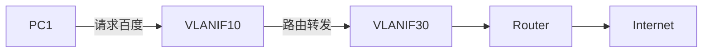
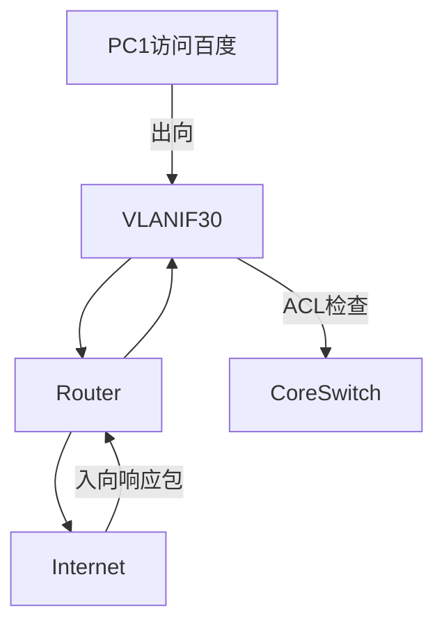

# 三层交换机防病毒
<ArticleGPT />

```bash
# 所有外网流量统一经过VLANIF30
acl number 3000
 rule deny tcp source 192.168.10.0 0.0.0.255 destination-port eq 445
interface Vlanif30
 traffic-filter inbound acl 3000
 ```

您的问题非常关键，这里涉及到 **流量方向** 和 **安全策略** 的深层逻辑。以下是详细解释：

---

### **1. 默认情况下的流量走向**

- ✅ **默认允许所有出向流量**：  
  核心交换机确实会自动通过路由表将VLAN10/20的流量导向VLANIF30出站，**无需额外放行规则**。

---

### **2. ACL 3000 的真实作用**
您看到的配置实际上是 **入向（inbound）过滤**，控制的是 **从路由器返回的流量**（非外网访问流量）：
```bash
acl number 3000
 rule deny tcp source 192.168.10.0 0.0.0.255 destination-port eq 445  # 阻止SMB端口
interface Vlanif30
 traffic-filter inbound acl 3000  # 作用于从路由器→核心交换机的方向
```

#### 流量方向分解：
| 方向                | 典型流量                          | 是否需要控制               |
|---------------------|----------------------------------|--------------------------|
| **Outbound** (出站) | PC访问百度                        | 通常允许（默认放行）       |
| **Inbound** (入站)  | 外部攻击流量/病毒回传             | 必须严格过滤              |

---

### **3. 为什么要在VLANIF30配置入向ACL？**
#### 安全防护场景：
1. **阻止病毒传播**  
   - 如勒索病毒常通过445端口横向扩散
   - 即使内网PC感染病毒，也无法通过VLANIF30接口反向感染其他VLAN

2. **防御外部攻击**  
   ```mermaid
   graph LR
       Hacker -->|扫描445端口| Router --> VLANIF30 --ACL阻断--> CoreSwitch
   ```

3. **合规性要求**  
   - 等保2.0三级要求：必须在网络边界部署访问控制

---

### **4. 企业网络的实际配置示例**
#### 完整安全策略（推荐）：
```bash
# 基础放行规则（出向默认允许，无需配置）
# 入向严格管控：
acl number 3000
 rule deny tcp destination-port eq 445  # 封堵SMB
 rule deny tcp destination-port eq 3389  # 封堵RDP
 rule permit ip  # 允许其他合法回程流量
interface Vlanif30
 traffic-filter inbound acl 3000
```

#### 典型流量处理流程：


---

### **5. 如果不配置入向ACL的风险**
- **风险案例**：  
  某企业未配置入向ACL，外部攻击者通过VPN漏洞接入内网后，利用SMB协议快速感染所有VLAN的PC。

- **攻击路径**：  
  ```mermaid
  graph LR
      Attacker --> Router --> VLANIF30 --> VLANIF10 --> PC1
      VLANIF30 --> VLANIF20 --> PC2
  ```

---

### **总结回答**
- 🔹 **出向流量**：VLANIF30默认允许所有VLAN访问外网（通过路由实现）  
- 🔹 **入向流量**：必须手动配置ACL过滤恶意流量（安全最佳实践）  
- 🔹 **核心原则**：企业网络必须遵循 **"默认拒绝，按需放行"** 的安全策略，尤其在网络边界位置。