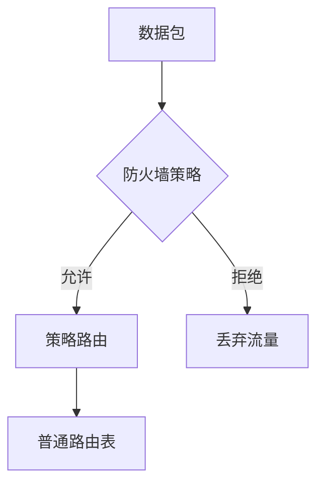
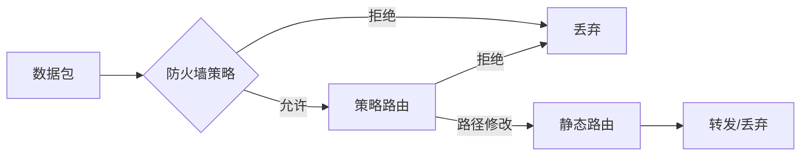

# 防火墙路由之策略路由（二）

:::code-group
```shell [自定义静态路由 命令：# show router policy]
chongqin-FortiGate-200F # show router policy
config router policy
    edit 1
        set input-device "port11"
        set srcaddr "wifi"
        set dstaddr "office"
        set action deny
    next
    edit 2
        set input-device "办公网1"
        set srcaddr "office"
        set dstaddr "wifi"
        set action deny
    next
    edit 11
        set input-device "办公网1"
        set srcaddr "all"
        set dstaddr "all"
        set gateway 222.178.157.65
        set output-device "port2"
        set status disable
    next
    edit 3
        set input-device "port11"
        set srcaddr "wifi"
        set dstaddr "hengangroup"
        set output-device "hengan-yd"
    next
    edit 4
        set input-device "port11"
        set srcaddr "wifi"
        set dstaddr "all"
        set gateway 183.230.155.1
        set output-device "port1"
    next
    edit 5
        set input-device "port10"
        set srcaddr "teshu"
        set dstaddr "hengangroup"
        set output-device "hengan-yd"
    next 
    edit 6
        set input-device "port10"
        set srcaddr "teshu"
        set dstaddr "all"
        set gateway 183.230.155.1
        set output-device "port1"
    next 
    edit 9
        set input-device "port12"
        set srcaddr "jiankong-server"
        set dstaddr "all"
        set gateway 183.230.155.1
        set output-device "port1"
    next 
    edit 10
        set input-device "办公网1"
        set srcaddr "office"
        set dstaddr "jiankong"
        set action deny
        set status disable
    next 
    edit 7
        set input-device "port12"
        set srcaddr "jiankong"
        set dstaddr "all"
        set action deny
        set status disable
    next 
end      
```

```shell [防火墙策略命令：# show firewall policy]
chongqin-FortiGate-200F # show firewall policy
config firewall policy
    edit 3
        set name "office-net2"
        set uuid cc878c42-440c-51ef-660f-eb3e82cbb8a7
        set srcintf "办公网1"
        set dstintf "port2"
        set action accept
        set srcaddr "office"
        set dstaddr "all"
        set schedule "always"
        set service "ALL"
        set utm-status enable
        set nat enable
    next
    edit 4
        set name "wifi-net1"
        set uuid dd62f632-440c-51ef-a9ec-da4c6ab77ba0
        set srcintf "port11"
        set dstintf "port1"
        set action accept
        set srcaddr "wifi"
        set dstaddr "all"
        set schedule "always"
        set service "ALL"
        set nat enable
    next
    edit 2
        set name "office-net1"
        set uuid b2d7e6ac-440c-51ef-3772-829389fafb70
        set srcintf "办公网1"
        set dstintf "port1"
        set action accept
        set srcaddr "office"
        set dstaddr "all"
        set schedule "always"
        set service "ALL"
        set nat enable
    next
    edit 5
        set name "office-hengan"
        set uuid fdad63d2-440c-51ef-a1c4-3be65eecdfd3
        set srcintf "办公网1"
        set dstintf "virtual-wan-link"
        set action accept
        set srcaddr "all"
        set dstaddr "all"
        set schedule "always"
        set service "ALL"
    next 
    edit 6
        set name "hengan-office"
        set uuid 0f2730e8-440d-51ef-e2f9-4138c03218ed
        set srcintf "virtual-wan-link"
        set dstintf "办公网1"
        set action accept
        set srcaddr "all"
        set dstaddr "all"
        set schedule "always"
        set service "ALL"
    next 
    edit 8
        set name "hengan-jiankong"
        set uuid 69b84d94-440d-51ef-c083-8f2c5ef00d35
        set srcintf "virtual-wan-link"
        set dstintf "port12"
        set action accept
        set srcaddr "all"
        set dstaddr "all"
        set schedule "always"
        set service "ALL"
        set nat enable
    next 
    edit 9
        set name "kaoqin-hengan"
        set uuid 8363ed8e-440d-51ef-ea43-a958ad4ce61c
        set srcintf "port13"
        set dstintf "virtual-wan-link"
        set action accept
        set srcaddr "all"
        set dstaddr "all"
        set schedule "always"
        set service "ALL"
        set logtraffic all
    next 
    edit 10
        set name "hengan-kaoqin"
        set uuid 92878e4c-440d-51ef-8fe7-5ffcfba7ce87
        set srcintf "virtual-wan-link"
        set dstintf "port13"
        set action accept
        set srcaddr "all"
        set dstaddr "all"
        set schedule "always"
        set service "ALL"
    next 
    edit 11
        set name "wifi-hengan"
        set uuid b520face-440d-51ef-87c9-3f25c8311aac
        set srcintf "port11"
        set dstintf "virtual-wan-link"
        set action accept
        set srcaddr "all"
        set dstaddr "all"
        set schedule "always"
        set service "ALL"
    next 
    edit 12
        set name "hengan-wifi"
        set uuid c298ecca-440d-51ef-ed01-f67e2bd66ccc
        set srcintf "virtual-wan-link"
        set dstintf "port11"
        set action accept
        set srcaddr "all"
        set dstaddr "all"
        set schedule "always"
        set service "ALL"
    next 
    edit 1
        set name "teshu-net"
        set uuid 9d3d3784-440c-51ef-dd1c-358bc900e195
        set srcintf "port10"
        set dstintf "port1"
        set action accept
        set srcaddr "teshu"
        set dstaddr "all"
        set schedule "always"
        set service "ALL"
        set nat enable
    next 
    edit 13
        set name "teshu-hengan"
        set uuid de74e8ae-440d-51ef-7be9-766364c48fd1
        set srcintf "port10"
        set dstintf "virtual-wan-link"
        set action accept
        set srcaddr "all"
        set dstaddr "all"
        set schedule "always"
        set service "ALL"
    next 
    edit 14
        set name "hengan-teshu"
        set uuid f41b1b1a-440d-51ef-3374-8cc5b64bf6d3
        set srcintf "virtual-wan-link"
        set dstintf "port10"
        set action accept
        set srcaddr "all"
        set dstaddr "all"
        set schedule "always"
        set service "ALL"
    next 
    edit 21
        set name "可访问监控段"
        set uuid 3dde5a8a-ad83-51ef-2d5a-90b151e94a71
        set srcintf "办公网1"
        set dstintf "port12"
        set action accept
        set srcaddr "重庆文件服务器（临时）" "张俊杰的笔记本" "保安队长的电脑" "保安队长的电脑2"
        set dstaddr "jiankong"
        set schedule "always"
        set service "ALL"
    next 
    edit 16
        set name "办公网只能访SIC平台"
        set uuid 44a9ae02-440e-51ef-3c8e-25e0066edeee
        set srcintf "办公网1"
        set dstintf "port12"
        set action accept
        set srcaddr "office"
        set dstaddr "jiankong-server"
        set schedule "always"
        set service "ALL"
        set logtraffic all
    next 
    edit 17
        set name "office-wifi"
        set uuid 6530f248-440e-51ef-168f-c249a6462a55
        set srcintf "办公网1"
        set dstintf "port11"
        set action accept
        set srcaddr "office"
        set dstaddr "wifi"
        set schedule "always"
        set service "ALL"
    next 
    edit 18
        set name "wifi-office"
        set uuid 76a61eae-440e-51ef-9981-09e32dc6f19a
        set srcintf "port11"
        set dstintf "办公网1"
        set action accept
        set srcaddr "wifi"
        set dstaddr "office"
        set schedule "always"
        set service "ALL"
    next 
    edit 15
        set name "监控-移动"
        set uuid 3246f4f4-440e-51ef-5d53-bf19aa747115
        set srcintf "port12"
        set dstintf "port1"
        set action accept
        set srcaddr "jiankong-server" "监控段上网空白IP"
        set dstaddr "all"
        set schedule "always"
        set service "ALL"
        set logtraffic all
        set nat enable
    next 
    edit 23
        set name "监控-电信"
        set uuid 5af3990c-b862-51ef-9aab-93fd9f376298
        set srcintf "port12"
        set dstintf "port2"
        set action accept
        set srcaddr "jiankong-server" "监控段上网空白IP" "一期录像机"
        set dstaddr "all"
        set schedule "always"
        set service "ALL"
        set nat enable
    next 
    edit 22
        set name "监控通隧道"
        set uuid 5290a2ca-adf2-51ef-b269-4053911498c7
        set srcintf "port12"
        set dstintf "virtual-wan-link"
        set action accept
        set srcaddr "jiankong"
        set dstaddr "all"
        set schedule "always"
        set service "ALL"
        set nat enable
    next 
end
```
:::

### **📌 核心概念解析**

#### **1. `show router policy`（策略路由）**
- **作用**：强制修改流量的**转发路径**（出口接口/网关）
- **优先级**：高于普通路由表，但低于防火墙策略
- **典型应用**：
  - 指定某些流量走特定WAN口
  - VPN流量分流
  - 基于源IP的路径控制

#### **2. `show firewall policy`（防火墙策略）**
- **作用**：控制流量**是否允许通过**（安全过滤）
- **优先级**：最高（先过防火墙，再匹配路由）
- **典型应用**：
  - 允许/拒绝特定IP/端口的访问
  - NAT地址转换
  - 应用层控制（如URL过滤）

---

### **⚡ 策略优先级排序**


---

### **📊 静态路由 vs 策略路由 vs 防火墙策略对比表**

| **对比维度**       | **静态路由**                          | **策略路由 (Policy Route)**              | **防火墙策略 (Firewall Policy)**        |
|--------------------|--------------------------------------|-----------------------------------------|----------------------------------------|
| **配置命令**       | `config router static`               | `config router policy`                  | `config firewall policy`               |
| **工作层级**       | 网络层 (L3)                          | 网络层 (L3)                             | 网络层+传输层 (L3-L4)                  |
| **核心功能**       | 基础路径选择                         | 高级路径控制                            | 流量过滤与安全控制                     |
| **匹配条件**       | 仅目标IP/掩码                        | 源接口/IP+目的IP/协议                   | 五元组(IP/端口/协议)+应用/用户/时间    |
| **动作类型**       | 设置下一跳/出口接口                  | `accept`+指定路径 或 `deny`             | `accept`/`deny`+安全功能(NAT/UTM)     |
| **优先级**         | 低于策略路由                         | 高于静态路由，低于防火墙策略             | 最高（最先处理）                       |
| **NAT影响**        | ❌ 不影响                            | ✅ 可影响出口选择                       | ✅ 直接执行NAT                         |
| **典型应用**       | • 简单网络拓扑<br>• 默认网关设置      | • 多WAN负载均衡<br>• 基于源IP的路径控制 | • 访问控制列表(ACL)<br>• 安全防护      |
| **日志记录**       | ❌ 无                                | ⚠️ 仅记录`deny`                         | ✅ 完整记录allow/deny                  |
| **配置复杂度**     | 低                                   | 中                                      | 高                                     |

---

### **🔀 处理顺序流程图**


---

### **📌 您配置中的典型示例**
#### **1. 静态路由**
```bash
# 默认路由
config router static
    edit 1
        set gateway 222.178.157.65
        set device "port2"
```

#### **2. 策略路由**
```bash
# 强制WiFi流量走移动WAN
config router policy
    edit 4
        set input-device "port11"
        set srcaddr "wifi"
        set gateway 183.230.155.1
```

#### **3. 防火墙策略**
```bash
# 允许办公网访问互联网
config firewall policy
    edit 3
        set srcintf "办公网1"
        set dstintf "port2"
        set action accept
```

---

### **💡 关键结论**
1. **防火墙策略最先执行**：决定流量是否允许通过  
2. **策略路由第二执行**：在允许的流量中修改转发路径  
3. **静态路由最后生效**：处理未被策略路由覆盖的流量  

如果需要调整优先级或排查冲突，可以使用：  
```bash
diagnose debug flow trace start  # 查看完整流量处理过程
```