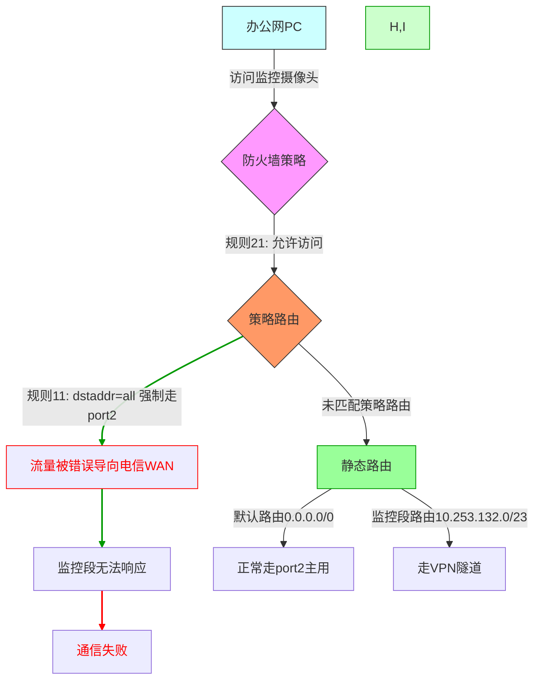

# 防火墙路由之防火墙策略（三）


静态路由是最原始的，如果你用策略路由的话，会覆盖他的优先级。然后，静态路由的配置，一般只需要一个同外网的出口就行了。策略路由，也可以叫做自定义静态路由，他的优先级可以比静态路由还高，一般用于网络出口，选择哪一个WAN的出口方向，但是要注意的是，防火墙策略的优先级很高，他是作用于局域网内不同LAN之间和NAT的，所以他可以配置一个PORT有不同的出口方向，并且可以均衡的分布流量，但是，如何你配置了一条策略路由，他的出口流向就被锁定了，就会只允许这一个出口的方向。比如，我的办公网在防火墙策略里面配置了多个互通网段，比如访问监控段，WIFI段，考勤段等等，但如果你配置了一条策略路由出口WAN，那么办公网的防火墙策略就会失效，只会允许让他出口指定的WAN，所以，办公网的策略路由出口WAN可以不用配置，0.0.0.0/0                 [10/0] via 222.178.157.65, port2, [1/0]
                                 [10/0] via 183.230.155.1, port1, [2/0]，静态路由就已经配置了公网出口，不用专门配置一条通WAN的策略路由，也可以访问外网。


### **📝 我的网络配置踩坑笔记：当策略路由"杀死"了内网访问**

#### **🚦 故事背景**
最近在公司防火墙上做了以下配置：
1. **防火墙策略**：允许办公网（`办公网1`）与监控段/WiFi段/考勤段互通
2. **静态路由**：配置了双WAN出口（电信`port2`主用，移动`port1`备用）
3. **策略路由**：想让办公网所有外网流量走电信WAN，于是加了这条：
   ```bash
   edit 11
       set input-device "办公网1"
       set srcaddr "all"
       set dstaddr "all"           # 全流量匹配
       set output-device "port2"   # 强制走电信
   ```

#### **💥 问题现象**
配置完成后：
- 办公网访问外网正常（走电信）
- **但办公网突然无法访问监控摄像头！**  
  （明明防火墙策略`edit 21`允许办公网→监控段）

#### 🔍 **排查过程**
1. 检查防火墙策略 → 规则存在且命中计数增加
2. 执行流量跟踪：
   ```bash
   diagnose debug flow trace start 100 filter saddr 办公网IP daddr 监控段IP
   ```
3. **发现真相**：
   - 流量匹配了策略路由的`dstaddr all`  
   - 被强制推向`port2`（电信WAN）  
   - 监控段无法通过WAN口回程 → 通信中断

### **🔧 策略路由冲突的Mermaid流程图**



---

#### **🎨 图表说明**
1. **红色故障流**：展示因`dstaddr=all`导致的内网访问中断
2. **绿色正确流**：对比修正后的理想状态
3. **关键节点标注**：
   - 防火墙策略（紫色）：权限检查点
   - 策略路由（橙色）：路径强制点
   - 冲突点（红色边框）：错误配置位置


---


#### 🧠 **问题本质**
策略路由像"霸道总裁"，**只要匹配就强制执行**，完全不管：
- 防火墙是否已放行
- 目标地址是否是内网
- 是否会影响其他业务

#### ✅ **解决方案**
给策略路由加上"排除条款"：
```bash
edit 11
    set dstaddr "!10.253.132.0/23 !172.18.20.0/23 !192.168.0.0/16"
```
（所有内网段前加`!`表示排除）

#### 💡 **经验总结**
1. **策略路由是"外科手术刀"**：  
   - 精准控制特定流量（如：仅外网走电信）
   - 绝不滥用`dstaddr all`这种"核武器"

2. **防火墙策略才是"大管家"**：  
   - 内网互访规则应该交给防火墙策略管理
   - 策略路由只辅助做路径优化

3. **配置口诀**：  
   > "防火策略开权限，策略路由调路线  
   > 内网地址要排除，全量匹配最危险"

（附当时的问题截图和解决后的流量跟踪对比图）  

---

这样改写是否更符合您博客笔记的风格？如需调整细节可随时告诉我~