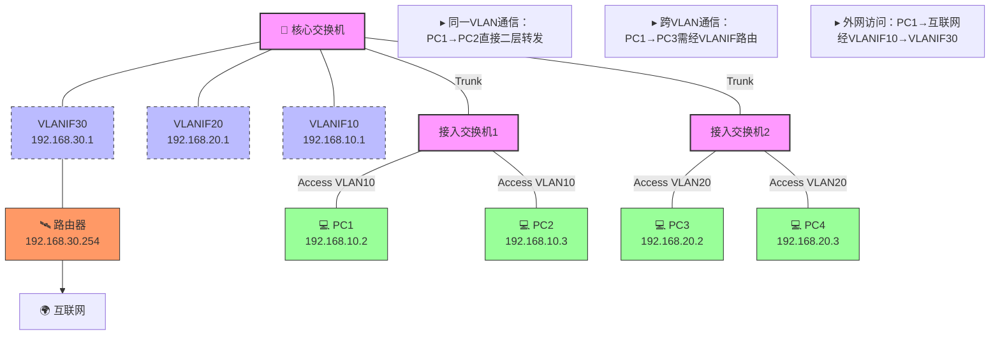
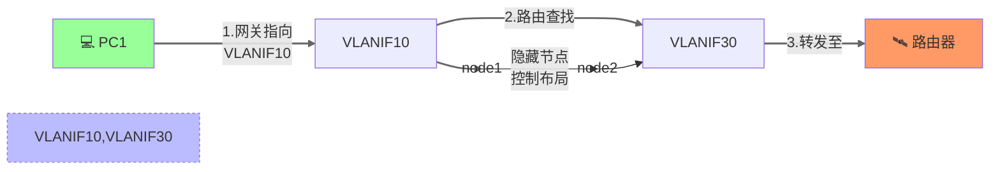
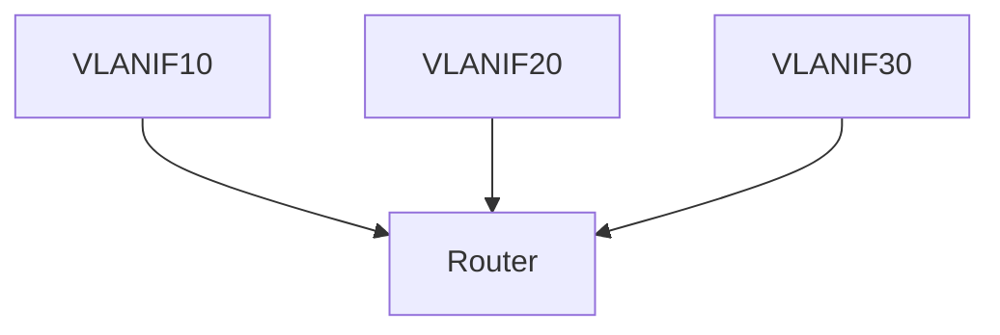
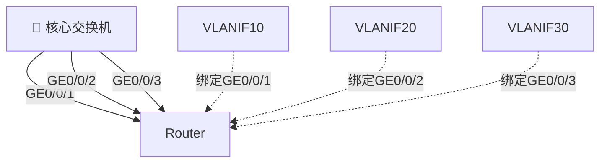

# 交换机的 VLANIF 接口详解

## 🎯 VLANIF 是什么？

VLANIF（VLAN Interface）是三层交换机或路由器上创建的**虚拟三层接口**，也称为 SVI（Switch Virtual Interface）。它不是物理接口，而是为 VLAN 创建的虚拟逻辑接口。

## 🔍 VLANIF 的特性

1. **虚拟三层接口**：
   - 🖥️ 工作在 OSI 模型的第三层（网络层）
   - 🔌 可以配置 IP 地址，作为该 VLAN 的网关
   - 🌉 实现不同 VLAN 之间的通信

2. **与物理接口的区别**：
   - 🔧 物理接口是实际存在的硬件端口
   - 🧩 VLANIF 是逻辑上创建的软件接口

## ❓ 为什么可以配置多个 VLANIF？

可以配置多个 VLANIF 的原因包括：

1. **支持多个 VLAN 的三层通信**：
   - 🏷️ 每个 VLAN 可以有自己的 VLANIF 接口
   - 📌 例如：VLAN 10 对应 VLANIF 10，VLAN 20 对应 VLANIF 20

2. **实现 VLAN 间路由**：
   ```mermaid
   graph LR
     PC1(VLAN 10) -->|VLANIF 10| Switch
     PC2(VLAN 20) -->|VLANIF 20| Switch
     Switch --> Router
   ```

3. **灵活的网络规划**：
   - 🌐 不同 VLAN 可以使用不同网段的 IP 地址
   - 🛡️ 便于实施访问控制策略

## 💡 VLANIF 的 IP 地址性质

1. **是虚拟地址但功能完整**：
   - 🎭 虽然是逻辑上配置的地址
   - 💪 但具有完整的三层功能，可以收发 IP 数据包

2. **典型配置示例**：
   ```bash
   interface Vlanif10
    ip address 192.168.10.1 255.255.255.0
   !
   interface Vlanif20
    ip address 192.168.20.1 255.255.255.0
   ```

3. **实际应用场景**：
   - 🚪 作为 VLAN 内主机的默认网关
   - 🛣️ 用于 VLAN 之间的路由转发
   - 🌍 实现与外部网络的三层通信

## 🏁 总结

VLANIF 是三层交换机上为 VLAN 创建的虚拟三层接口，虽然本身是逻辑接口，但具有完整的 IP 功能。可以配置多个 VLANIF 是为了支持多个 VLAN 的三层通信需求，每个 VLANIF 通常对应一个不同的 IP 子网，作为该 VLAN 内主机的网关。

## 🏗️ VLAN Interface（虚拟局域网接口）

VLAN Interface是一种虚拟的网络接口，它允许在交换机上创建虚拟的网络，从而实现网络隔离和安全控制，提高网络的安全性和性能。

> 以下是一个简单的VLAN Interface架构图，看懂Vlanif，如果觉得图例太小了，右上角可以切换阅读视图。



> [!IMPORTANT] 
> 在这张拓扑图中，**只有 VLANIF 30 直接连接路由器并通往外网**，但其他 VLANIF 接口（如 VLANIF >10/20）也可以通过路由转发间接访问外网。以下是详细解释：
>

---

### 🔑 关键点解析：
1. **VLANIF 30 的特殊性**：
   - 🎯 是核心交换机与路由器之间的**专属网关接口**
   - 📡 配置了与路由器直连的 IP 段（`192.168.30.0/24`）
   - 🚀 承担所有 VLAN 访问外网的**出口角色**

2. **其他 VLANIF 的访问路径**：


3. **路由表示例**：
   | 目标网络       | 下一跳        | 出口接口  |
   |----------------|---------------|----------|
   | 192.168.10.0/24 | Direct        | VLANIF10 |
   | 192.168.20.0/24 | Direct        | VLANIF20 |
   | 0.0.0.0/0       | 192.168.30.254 | VLANIF30 | ← 默认路由

---

### 🤔 为什么这样设计？
1. **安全隔离**：
   - 🔒 外网流量统一从 VLANIF 30 出口
   - 🛡️ 可在该接口集中配置 ACL/NAT 等安全策略

2. **简化管理**：
   ```shell
   ip route 0.0.0.0 0.0.0.0 192.168.30.254
   ```
   🎯 一条默认路由即可让所有 VLAN 访问外网

3. **典型业务流示例**：
   - **PC1 访问百度**：
     1. PC1 检查目标 IP 不在本地子网
     2. 将数据包发给默认网关 VLANIF10
     3. 核心交换机通过默认路由转发到 VLANIF30
     4. 路由器执行 NAT 后发送到互联网

---

### 🔄 如果需要其他 VLANIF 也能直连外网？
可以修改设计为：

但这样会导致：
- ⚠️ 需要配置更多物理链路或子接口
- ⚠️ 增加路由策略复杂度
- ⚠️ 不利于统一安全控制

✅ 建议保持原设计的单出口架构，这是企业网络的最佳实践。

以下是实现该拓扑的完整配置命令示例（以华为交换机为例）：

---

### 🛠️ **1. 核心交换机配置**
```bash
# 创建VLAN
<Huawei> system-view
[Huawei] sysname CoreSwitch
[CoreSwitch] vlan batch 10 20 30

# 配置VLANIF接口
[CoreSwitch] interface Vlanif 10
[CoreSwitch-Vlanif10] ip address 192.168.10.1 24
[CoreSwitch-Vlanif10] quit

[CoreSwitch] interface Vlanif 20
[CoreSwitch-Vlanif20] ip address 192.168.20.1 24
[CoreSwitch-Vlanif20] quit

[CoreSwitch] interface Vlanif 30
[CoreSwitch-Vlanif30] ip address 192.168.30.1 24
[CoreSwitch-Vlanif30] quit

# 配置默认路由（指向路由器）
[CoreSwitch] ip route-static 0.0.0.0 0 192.168.30.254

# 配置连接接入交换机的Trunk端口（以G0/0/1为例）
[CoreSwitch] interface GigabitEthernet 0/0/1
[CoreSwitch-GigabitEthernet0/0/1] port link-type trunk
[CoreSwitch-GigabitEthernet0/0/1] port trunk allow-pass vlan 10 20
[CoreSwitch-GigabitEthernet0/0/1] quit

# 配置连接路由器的Access端口（以G0/0/24为例）
[CoreSwitch] interface GigabitEthernet 0/0/24
[CoreSwitch-GigabitEthernet0/0/24] port link-type access
[CoreSwitch-GigabitEthernet0/0/24] port default vlan 30
[CoreSwitch-GigabitEthernet0/0/24] quit
```

---

### 🛠️ **2. 接入交换机配置（以接入交换机1为例）**
```bash
# 创建VLAN
<Huawei> system-view
[Huawei] sysname AccessSwitch1
[AccessSwitch1] vlan 10

# 配置连接PC的Access端口（以G0/0/1-2为例）
[AccessSwitch1] interface GigabitEthernet 0/0/1
[AccessSwitch1-GigabitEthernet0/0/1] port link-type access
[AccessSwitch1-GigabitEthernet0/0/1] port default vlan 10
[AccessSwitch1-GigabitEthernet0/0/1] quit

[AccessSwitch1] interface GigabitEthernet 0/0/2
[AccessSwitch1-GigabitEthernet0/0/2] port link-type access
[AccessSwitch1-GigabitEthernet0/0/2] port default vlan 10
[AccessSwitch1-GigabitEthernet0/0/2] quit

# 配置连接核心交换机的Trunk端口（以G0/0/24为例）
[AccessSwitch1] interface GigabitEthernet 0/0/24
[AccessSwitch1-GigabitEthernet0/0/24] port link-type trunk
[AccessSwitch1-GigabitEthernet0/0/24] port trunk allow-pass vlan 10
[AccessSwitch1-GigabitEthernet0/0/24] quit
```

---

### 🛠️ **3. 路由器配置（以华为AR路由器为例）**
```bash
<Huawei> system-view
[Huawei] sysname Router
[Router] interface GigabitEthernet 0/0/0
[Router-GigabitEthernet0/0/0] ip address 192.168.30.254 24
[Router-GigabitEthernet0/0/0] quit

# 配置NAT实现外网访问（假设外网接口为G0/0/1）
[Router] interface GigabitEthernet 0/0/1
[Router-GigabitEthernet0/0/1] ip address 公网IP 掩码
[Router-GigabitEthernet0/0/1] quit

[Router] acl number 2000
[Router-acl-basic-2000] rule permit source 192.168.0.0 0.0.255.255
[Router-acl-basic-2000] quit

[Router] nat address-group 1 公网IP 公网IP
[Router] interface GigabitEthernet 0/0/1
[Router-GigabitEthernet0/0/1] nat outbound 2000 address-group 1
[Router-GigabitEthernet0/0/1] quit

# 回程路由（非必须，根据实际网络添加）
[Router] ip route-static 192.168.10.0 24 192.168.30.1
[Router] ip route-static 192.168.20.0 24 192.168.30.1
```

---

### 🛠️ **4. PC配置（以Windows为例）**
```powershell
# PC1配置：
netsh interface ip set address "以太网" static 192.168.10.2 255.255.255.0 192.168.10.1

# PC3配置：
netsh interface ip set address "以太网" static 192.168.20.2 255.255.255.0 192.168.20.1
```

---

### 📌 关键配置说明：
| 配置项               | 作用                                                                 |
|----------------------|----------------------------------------------------------------------|
| `port trunk allow-pass vlan` | 允许指定VLAN通过Trunk链路                                          |
| `ip route-static 0.0.0.0 0`  | 默认路由，使所有非本地流量指向VLANIF30                              |
| `nat outbound`        | 实现内网地址到公网地址的转换                                       |
| `port default vlan`   | 将Access端口划入指定VLAN                                           |

> 💡 **调试技巧**：  
> 在核心交换机上使用 `display ip routing-table` 查看路由表，使用 `ping -a 192.168.10.1 8.8.8.8` 测试外网连通性。

## ⚠️ 注意

> [!WARNING]
> 1. 🔌 接入交换机不必写一条静态到核心的交换机；
> 2. 🌉 三层交换机的 Vlanif 默认互通，写一个 Vlanif 地址静态路由到边界路由即可；
> 3. 🕳️ 路由黑洞，
> 4. ⚠️ 三层交换机的 Vlanif 地址不能和边界路由的地址冲突；
> 5. 🌍 外网流量统一控制。

## 🔧 技术容错

如果你觉得交换机多vlanif接入边界出口路由比较好使，
可以考虑以下技术容错方案：

1. **冗余设计**：
   - 🔄 部署多个核心交换机，每个交换机上配置不同的 VLANIF


### 🎯 **何时可以考虑多VLANIF直连？**
#### 适用场景（需同时满足）：
- **严格流量隔离需求**：如金融网络要求生产/办公流量物理隔离
- **多ISP出口**：VLAN10走电信，VLAN20走联通
- **法规合规要求**：如等保三级中"安全区域边界隔离"

#### 实施建议：
```bash
# 采用子接口替代物理端口（节省硬件资源）
interface GigabitEthernet0/0/0.10
 dot1q termination vid 10
 ip address 192.168.10.1 24
```

---

您最初看到的建议实质是 **网络架构的KISS原则**（Keep It Simple, Stupid）的体现。多VLANIF直连路由器虽然功能上能实现，但会引入不必要的复杂度。企业网络设计应优先考虑：
1. **管理便捷性**  
2. **故障可预测性**  
3. **策略一致性**  
4. **资源利用率**

这种设计差异类似于城市交通规划：单出口架构像所有车辆通过一座立交桥出城（易管理），多VLANIF直连像为每个小区修独立出城道路（成本高且维护难）。