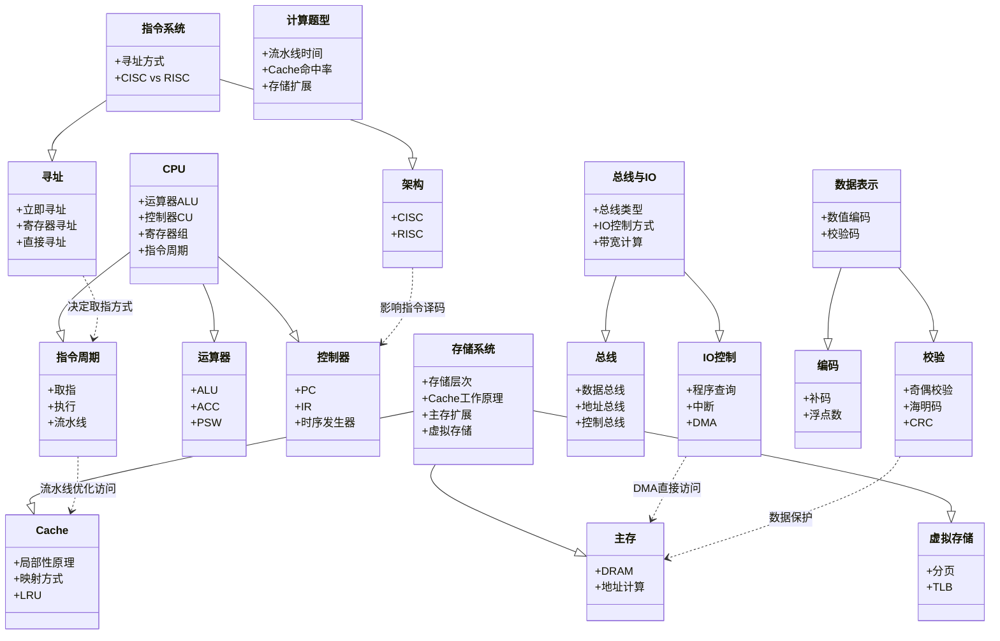
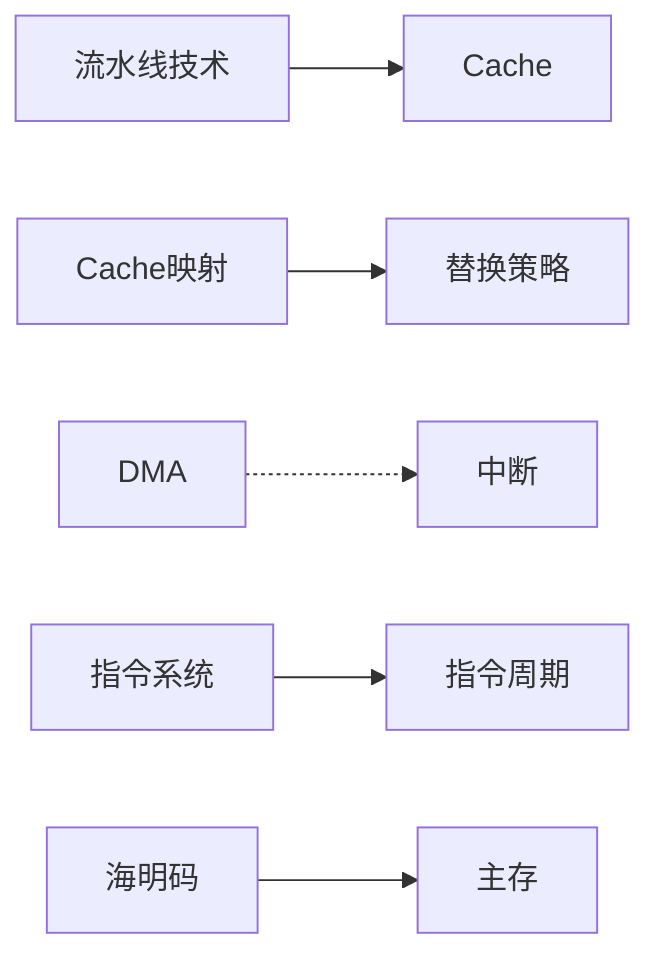
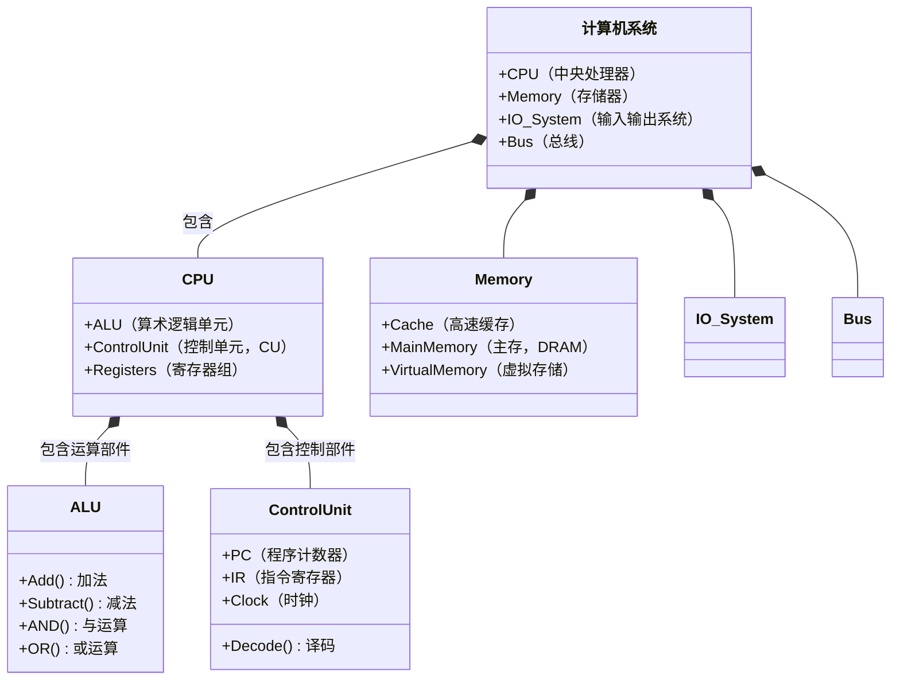
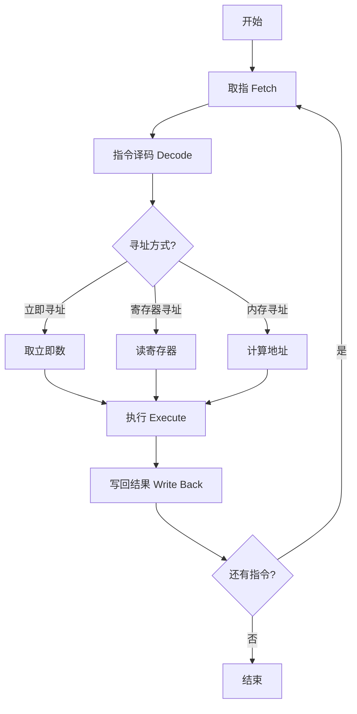
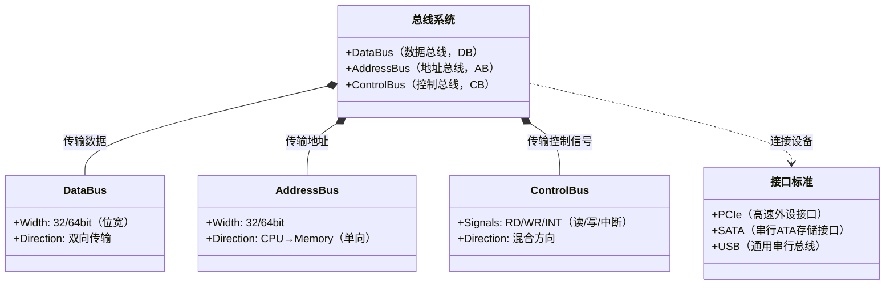
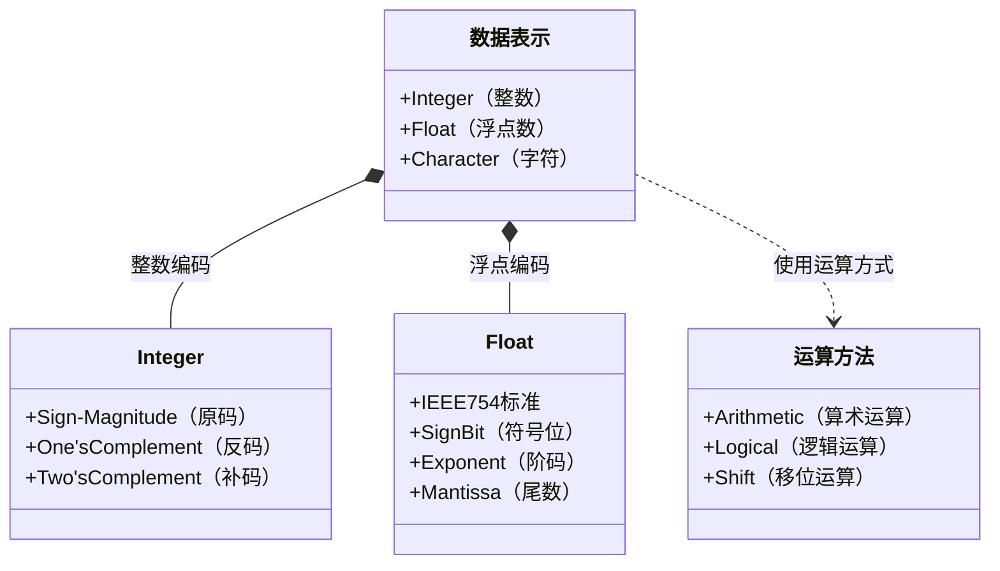
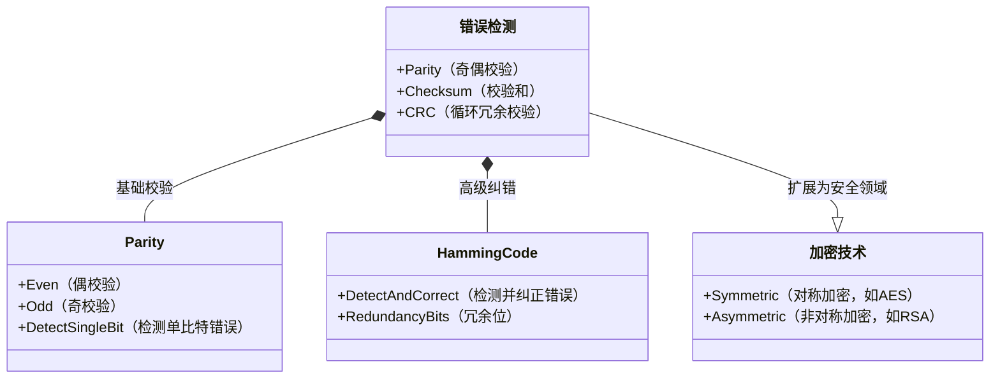

# 第一章 计算机硬件（第六版新教材）

## 1.1 计算机硬件的基本组成

计算机硬件是计算机系统的核心部分，由各种电子元件组成，如处理器、内存、输入输出设备等。

以下是使用 Mermaid 的 `classDiagram` 语法绘制的计算机组成与体系结构知识体系类图，按核心模块分块展示并保留逻辑关联：



### 图表特点：
1. **模块化分层**：
   - 6个主类表示核心模块（CPU、存储系统等）
   - 每个主类通过`--|>`继承关系展开子模块
   - 叶子节点为具体知识点（如ALU、DMA）

2. **关键关联**：
   - 使用`..>`虚线箭头表示跨模块依赖
   - 典型关联：
     - 流水线技术优化Cache访问
     - DMA机制绕过CPU直接访问主存
     - 校验码保护存储数据完整性

3. **布局优化**：
   - 同类知识点纵向排列（如所有校验方式在"校验"子类下）
   - 重要交互关系水平排列（如CPU与存储系统的交互）



### 使用建议：
1. 复制代码到支持Mermaid的工具（如VS Code、GitHub Markdown）
2. 聚焦颜色标识：
   ```mermaid
   classDiagram
       class CPU {
           #ffcccc
        }
       class 存储系统 {
           #ccffcc
        }
   ```
3. 如需强调特定路径，可添加注释：
   ```mermaid
   classDiagram
       note for 指令周期 "时钟周期=1/主频\n流水线加速比=非流水线时间/流水线时间"
   ```

该图表完整呈现了计算机组成原理的知识架构，同时保持了工程化分类和可读性。

### **计算机组成与体系结构 超详细知识点总结**  

---

## **1. CPU 结构与工作原理**
### **1.1 CPU 主要组成**
CPU（中央处理器）由 **运算器、控制器、寄存器组、内部总线** 组成：
- **运算器（ALU, Arithmetic Logic Unit）**：
  - 负责算术运算（加减乘除）和逻辑运算（与或非）。
  - 包含：
    - **ALU（算术逻辑单元）**：执行运算。
    - **累加器（ACC）**：暂存运算结果。
    - **通用寄存器**：存储临时数据（如 AX、BX）。
    - **状态寄存器（PSW）**：记录运算状态（如进位、溢出、零标志）。
- **控制器（CU, Control Unit）**：
  - 负责指令的执行流程控制。
  - 包含：
    - **程序计数器（PC）**：存放下一条指令的地址。
    - **指令寄存器（IR）**：存放当前执行的指令。
    - **指令译码器**：解析指令的操作码。
    - **时序发生器**：控制 CPU 各部分的时序。
    - **操作控制器**：生成控制信号。
- **寄存器组**：
  - **通用寄存器**（AX、BX、CX、DX）：存储操作数或中间结果。
  - **地址寄存器**（MAR, Memory Address Register）：存放内存地址。
  - **数据寄存器**（MDR, Memory Data Register）：存放内存数据。
  - **标志寄存器**（FLAGS）：记录 CPU 状态（如零标志 ZF、进位标志 CF）。
- **内部总线**：连接 CPU 内部各部件的数据通路。

### **1.2 指令执行过程**
- **指令周期** = **取指周期 + 执行周期**：
  1. **取指阶段**：
     - PC 指向下一条指令地址。
     - 从内存读取指令到 IR。
  2. **译码阶段**：
     - 指令译码器解析 IR 中的操作码。
  3. **执行阶段**：
     - ALU 执行运算，结果存入寄存器或内存。
- **机器周期（CPU 周期）**：
  - 完成一个基本操作（如取指、访存）的时间，通常由多个时钟周期组成。
- **时钟周期**：
  - CPU 的最小时间单位，由主频决定（如 1GHz = 1ns/周期）。

### **1.3 指令流水线**
- **基本概念**：
  - 将指令执行划分为多个阶段（取指、译码、执行、访存、写回），并行执行以提高吞吐率。
- **性能计算**：
  - **吞吐率（TP）** = 单位时间完成的指令数 = `1 / 最长流水段周期`。
  - **加速比** = `非流水线时间 / 流水线时间`。
  - **总时间** = `(k + n - 1) * Δt`（k 为阶段数，n 为指令数，Δt 为最长阶段时间）。
- **流水线冲突**：
  - **结构冲突**：资源竞争（如 ALU 被占用）。
  - **数据冲突**：数据依赖（如 RAW 写后读）。
  - **控制冲突**：分支指令导致流水线清空。

---

## **2. 存储器系统**
### **2.1 存储层次结构**
| **存储层次** | **速度** | **容量** | **用途** | **实现技术** |
|-------------|---------|---------|---------|-------------|
| **寄存器** | 最快 | 最小 | CPU 内部数据存储 | SRAM |
| **Cache（高速缓存）** | 次快 | 较小 | 缓存 CPU 常用数据 | SRAM |
| **主存（内存）** | 中等 | 较大 | 运行程序存储 | DRAM |
| **外存（硬盘/SSD）** | 最慢 | 最大 | 长期数据存储 | 磁存储/闪存 |

### **2.2 Cache 工作原理**
- **局部性原理**：
  - **时间局部性**：最近访问的数据可能再次访问。
  - **空间局部性**：访问的数据附近的数据可能被访问。
- **Cache 映射方式**：
  - **直接映射**：每个主存块只能映射到 Cache 固定位置。
  - **全相联映射**：主存块可映射到 Cache 任意位置。
  - **组相联映射**：Cache 分组，组内全相联（如 4 路组相联）。
- **Cache 替换策略**：
  - **LRU（最近最少使用）**、FIFO、随机替换。

### **2.3 主存扩展计算**
- **地址范围计算**：
  - 按字节编址：`结束地址 - 起始地址 + 1`（如 `CFFFFH - A0000H + 1 = 30000H = 192KB`）。
- **芯片数量计算**：
  - `总容量 / 单芯片容量`（注意单位转换，如 `192KB / 64KB = 3 片`）。

### **2.4 虚拟存储**
- **分页机制**：
  - 逻辑地址 = **页号 + 页内偏移**。
  - 物理地址 = **块号 + 页内偏移**。
- **TLB（快表）**：
  - 缓存页表项，加速地址转换。
- **页面置换算法**：
  - **FIFO**、**LRU**、**OPT（最优置换）**。

---

## **3. 总线与 I/O 系统**
### **3.1 总线分类**
| **总线类型** | **功能** | **特点** |
|-------------|---------|---------|
| **数据总线** | 传输数据 | 双向，宽度决定数据量（如 32 位、64 位） |
| **地址总线** | 传输地址 | 单向（CPU → 内存），宽度决定寻址空间 |
| **控制总线** | 传输控制信号 | 如读/写、中断请求、DMA 请求 |

### **3.2 I/O 控制方式**
| **方式** | **特点** | **适用场景** |
|---------|---------|-------------|
| **程序查询** | CPU 轮询设备状态 | 简单，效率低 |
| **中断** | 设备就绪后通知 CPU | 适用于低速设备 |
| **DMA（直接存储器访问）** | DMA 控制器管理数据传输 | 适用于高速设备（如磁盘） |

### **3.3 总线带宽计算**
- **公式**：
  \[
  \text{带宽} = \left( \frac{\text{总线频率}}{\text{时钟周期数}} \right) \times \text{数据宽度}
  \]
- **示例**：
  - 总线频率 200MHz，5 个时钟周期传输 32 位数据：
  \[
  \text{带宽} = \left( \frac{200M}{5} \right) \times 4B = 160MB/s
  \]

---

## **4. 指令系统与寻址方式**
### **4.1 常见寻址方式**
| **寻址方式** | **示例** | **特点** |
|-------------|---------|---------|
| **立即寻址** | `MOV R1, 45` | 操作数直接包含在指令中 |
| **寄存器寻址** | `ADD R1, R2` | 操作数在寄存器中 |
| **直接寻址** | `LOAD R1, [0x100]` | 指令中直接给出内存地址 |
| **寄存器间接寻址** | `LOAD R1, [R2]` | 寄存器中存操作数的地址 |

### **4.2 CISC vs RISC**
| **特性** | **CISC（复杂指令集）** | **RISC（精简指令集）** |
|---------|----------------------|----------------------|
| **指令数量** | 多，功能复杂 | 少，功能简单 |
| **指令长度** | 可变长 | 固定长 |
| **寻址方式** | 多样 | 较少（通常仅 Load/Store 访存） |
| **实现方式** | 微程序控制 | 硬布线控制 |
| **典型架构** | x86 | ARM、MIPS |

---

## **5. 数据表示与校验**
### **5.1 数值编码**
- **补码**：
  - 用于带符号整数运算，可统一加减法。
  - 范围：`-2^{n-1} ~ 2^{n-1}-1`（如 8 位补码：-128 ~ 127）。
- **浮点数（IEEE 754）**：
  - 结构：`符号位 + 阶码（指数） + 尾数（小数部分）`。

### **5.2 校验码**
| **校验方式** | **功能** | **特点** |
|-------------|---------|---------|
| **奇偶校验** | 检测奇数位错误 | 不能纠错 |
| **海明码** | 检测并纠正单比特错误 | 校验位数 `k` 满足 `2^k ≥ m + k + 1` |
| **CRC（循环冗余校验）** | 检测数据传输错误 | 常用于网络通信 |

---

## **6. 高频计算题型**
### **6.1 流水线时间计算**
- **公式**：
  \[
  T = (k + n - 1) \times \Delta t
  \]
  - `k` = 流水线阶段数
  - `n` = 指令数
  - `Δt` = 最长阶段时间
- **示例**：
  - 5 阶段流水线，Δt=10ns，执行 100 条指令：
  \[
  T = (5 + 99) \times 10 = 1040ns
  \]

### **6.2 Cache 命中率计算**
- **公式**：
  \[
  \text{平均访问时间} = \text{Cache 命中时间} \times \text{命中率} + \text{主存访问时间} \times (1 - \text{命中率})
  \]
- **示例**：
  - Cache 访问时间 3ns，主存 30ns，平均 3.27ns，求命中率：
  \[
  3.27 = 3 \times H + 30 \times (1 - H) \Rightarrow H = 99\%
  \]

---

## **总结**
1. **CPU 结构**：运算器、控制器、寄存器、总线。
2. **存储系统**：Cache、主存、虚拟存储。
3. **总线与 I/O**：数据/地址/控制总线，DMA 机制。
4. **指令系统**：寻址方式、CISC vs RISC。
5. **数据校验**：海明码、CRC。
6. **计算题型**：流水线时间、Cache 命中率、存储扩展。

掌握这些知识点，可覆盖计算机组成原理 90% 的考试内容！


以下是分模块绘制的Mermaid图表，每个模块采用最适合的图表类型展示其知识结构和流程：

---

### 1. 计算机组成结构（类图示例）


---

### 2. 指令系统流程（流程图示例）


---

### 3. 总线与接口（类图示例）


---

### 4. 数据表示与运算（类图示例）


---

### 5. 校验与加密（类图示例）


---

### 图表说明：
1. **计算机组成类图**：
   - 展示CPU、内存、I/O的包含关系
   - 重点突出ALU和控制单元的组件

2. **指令系统流程图**：
   - 清晰呈现取指-译码-执行-写回的流水线阶段
   - 用条件分支展示不同寻址方式

3. **总线与接口类图**：
   - 区分三类总线的方向特性
   - 显示总线系统与接口的连接关系

4. **数据表示类图**：
   - 分类展示整数/浮点表示法
   - 关联基本运算操作

5. **校验与加密类图**：
   - 分层显示错误检测与加密技术
   - 强调汉明码的纠错能力

所有图表均可直接粘贴到支持Mermaid的工具中使用，如需调整：
- 类图：修改`*--`（组合）或`..>`（依赖）关系
- 流程图：调整`-->`箭头方向或添加`{条件}`分支
- 颜色：添加`class ClassName { #ff0000 }`定义
