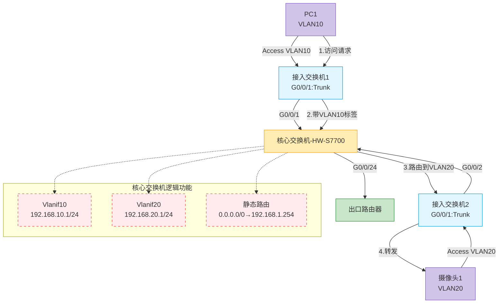
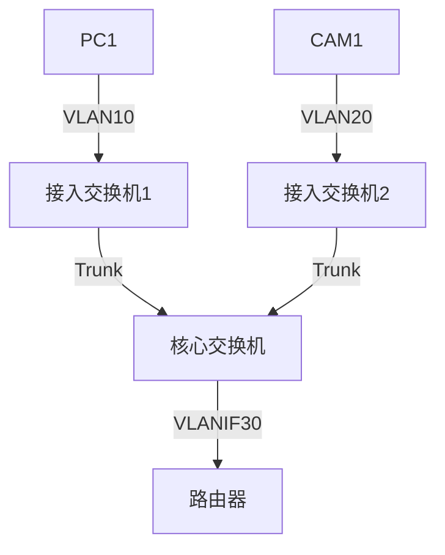

# 企业级网络架构分析

## **企业级网络架构分析**



> 根据Mermaid图中的拓扑结构（1台核心交换机+2台接入交换机）分别给出配置方案。以下是完全匹配您架构的详细配置清单：

---

### **网络架构回顾**


---

### **核心交换机配置 (Huawei S7700)**
```bash
# 基础配置
sysname CORE-SW
vlan batch 10 20 30  # 创建业务VLAN和管理VLAN

# VLANIF三层接口
interface Vlanif10
 description Office_Users
 ip address 192.168.10.1 24
 dhcp select interface
 dhcp server dns-list 114.114.114.114 223.5.5.5
 dhcp server excluded-ip-address 192.168.10.1 192.168.10.50  # 保留前50个IP
quit

interface Vlanif20
 description IP_Camera
 ip address 192.168.20.1 24
quit

interface Vlanif30
 description To_Router
 ip address 192.168.30.1 24
quit

# 连接路由器的端口（物理接口）
interface GigabitEthernet0/0/24
 port link-type access
 port default vlan 30
quit

# 连接接入交换机的Trunk端口
interface range GigabitEthernet 0/0/1 to 0/0/2
 port link-type trunk
 port trunk allow-pass vlan 10 20 30  # 放行业务VLAN和管理VLAN
 port trunk pvid vlan 1  # 设置Native VLAN
 storm-control broadcast min-rate 1000  # 广播风暴抑制
quit

# 路由与安全
ip route-static 0.0.0.0 0 192.168.30.254  # 默认路由

acl name PROTECT-CORE
 rule 5 deny tcp destination-port eq 445  # 阻断SMB
 rule 10 permit ip
interface Vlanif10
 traffic-filter inbound acl name PROTECT-CORE
quit
```

---

### **接入交换机1配置 (Huawei S5700) - 连接PC**
```bash
sysname ACCESS-SW1
vlan batch 10  # 只需创建本端VLAN

# 连接PC的Access端口
interface GigabitEthernet0/0/1
 port link-type access
 port default vlan 10
 port-security enable
 port-security max-mac-num 1  # 严格MAC绑定
quit

# 上联核心的Trunk端口
interface GigabitEthernet0/0/24
 port link-type trunk
 port trunk allow-pass vlan 10
 undo negotiation auto  # 关闭自动协商
 speed 1000  # 强制千兆
quit

# 防环路保护（接入层关键配置）
loopback-detect enable
loopback-detect action shutdown  # 检测到环路自动关闭端口
```

---

### **接入交换机2配置 (Huawei S5700) - 连接摄像头**
```bash
sysname ACCESS-SW2
vlan batch 20  # 摄像头专用VLAN

# 连接摄像头的端口
interface GigabitEthernet0/0/1
 port link-type access
 port default vlan 20
 storm-control multicast min-rate 500  # 组播流量抑制
quit

# 上联核心的Trunk端口（与ACCESS-SW1对称配置）
interface GigabitEthernet0/0/24
 port link-type trunk
 port trunk allow-pass vlan 20
 undo negotiation auto
 speed 1000
quit

# 摄像头网络特殊优化
interface Vlanif20
 igmp-snooping enable  # 启用组播侦听
quit
```

---

### **路由器关键配置 (Huawei AR2200)**
```bash
# 连接核心交换机的接口
interface GigabitEthernet0/0/0
 ip address 192.168.30.254 24
quit

# NAT出口配置
interface GigabitEthernet0/0/1
 ip address 公网IP 掩码
 nat outbound  # 启用源NAT
quit

# 回程路由
ip route-static 192.168.10.0 24 192.168.30.1
ip route-static 192.168.20.0 24 192.168.30.1
```

---

### **配置对照表**

| 设备类型       | 核心功能                          | 安全配置                          | 特殊优化                     |
|----------------|----------------------------------|----------------------------------|----------------------------|
| **核心交换机** | VLAN间路由、DHCP服务             | ACL过滤高危端口                  | 风暴抑制                   |
| **接入交换机1** | PC接入                          | 端口安全(MAC绑定)                | 环路检测                   |
| **接入交换机2** | 摄像头接入                      | 组播流量控制                    | IGMP Snooping             |
| **路由器**     | NAT转换、默认网关               | 防火墙策略(需额外配置)          | -                          |

---

### **验证命令清单**
1. **检查VLAN互通性**：
   ```bash
   # 在核心交换机执行：
   ping -a 192.168.10.1 192.168.20.1
   ```

2. **测试DHCP服务**：
   ```bash
   display dhcp server ip-in-use vlan 10
   ```

3. **监控端口安全**：
   ```bash
   # 在接入交换机执行：
   display port-security
   ```

4. **查看路由表**：
   ```bash
   display ip routing-table
   ```

---

### **为什么这样设计？**
1. **核心层**：集中路由/DHCP/ACL策略，避免接入层设备性能压力
2. **接入层1**：严格MAC绑定防止非法接入，适合办公PC环境
3. **接入层2**：优化组播传输，适应摄像头视频流特性
4. **统一管理**：所有设备通过VLAN1管理IP可达（需额外配置）

> 💡 **企业网络黄金法则**：核心做路由，接入做交换，安全策略分层部署！

:::tip 运维提示

+ 建议开启日志服务器功能：info-center loghost<br/>
+ 摄像头网络建议关闭STP：stp disable

:::