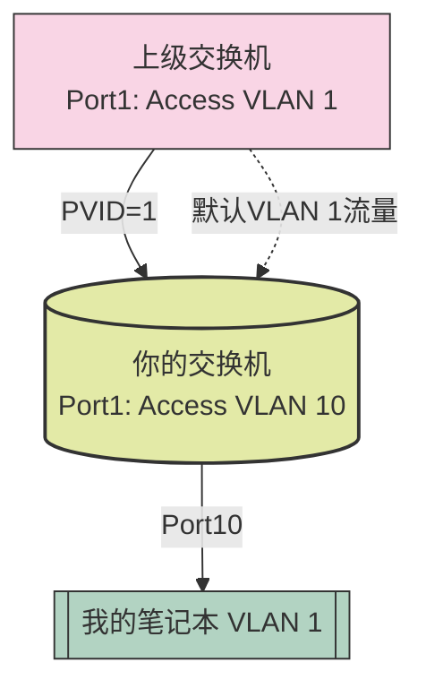
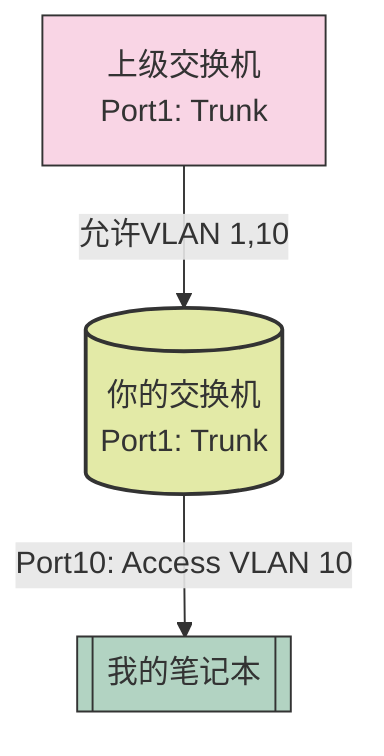
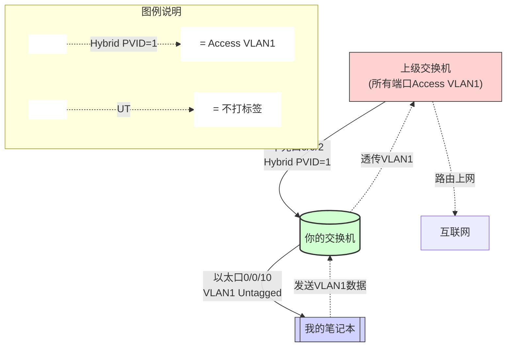
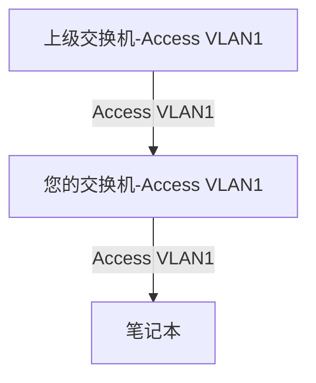
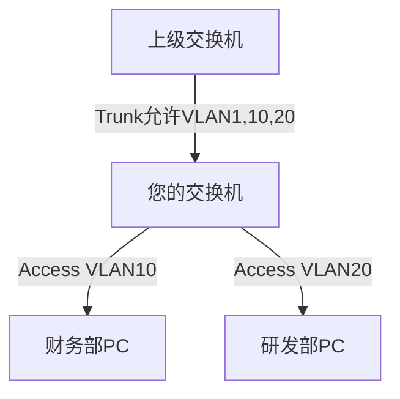

# 傻瓜型交换机架构最佳实践

## 1. 交换机的第一步

首先在Windows的设备管理器找到USB连接到交换机的端口，再用XShell连接到交换机的console口，输入密码登录，进入系统视图，修改交换机的名称，退出系统视图，保存配置，退出。


- 查看交换机连接是否成功。


- 配置XShell连接的端口号和协议


- 进入控制终端

> 第一次通过console口连接交换机会提示你设置密码，密码为ha123456
>
>  

```shell
# 现在我们来配置命令
<Huawei> system-view  # 进入系统视图
[Huawei] sysname SW1  # 修改设备名称（可选）

```


> 这串英文是 **华为交换机的系统日志（Syslog）消息**，用于记录配置变更事件。以下是详细解析：


### 📊 日志内容分解

| 字段                                           | 含义                                                         |
| ---------------------------------------------- | ------------------------------------------------------------ |
| `Jan 1 2008 00:33:42-05:13`                    | **时间戳**：交换机的默认时间（未同步NTP时可能显示初始日期2008年）。 |
| `SW1`                                          | **设备名称**：你通过 `sysname SW1` 修改后的交换机名称。      |
| `DS/4/DATASYNC_CFGCHANGE`                      | **日志类型**：<br> - `DS`：DataSync（数据同步模块）。<br> - `4`：日志级别（4=Warning，属于正常提示）。<br> - `DATASYNC_CFGCHANGE`：配置变更事件。 |
| `OID 1.3.6.1.4.1.2011.5.25.191.3.1`            | **SNMP对象标识符**：华为私有MIB节点，标识配置变更的具体类型。 |
| `configurations have been changed`             | **事件描述**：配置已发生变更。                               |
| `change number=1, loop count=1, max records=1` | **变更详情**：<br> - 当前变更序号为1。<br> - 变更循环计数为1。<br> - 最大记录数为1。 |

---

### 🔀 交换机NTP

- **正常现象**：这是华为交换机的标准行为，无需干预。  
- **若需关闭此类日志**（不推荐）：  
  
  ```bash
  [SW1] info-center source DS channel 0 log state off  # 关闭DS模块日志
  ```
- **建议操作**：  
  同步交换机时间（NTP）以获取准确日志时间戳：
  
  ```bash
  [SW1] ntp-service unicast-server 192.168.1.1  # 配置NTP服务器
  ```

---

## 2. 配置管理IP（用于远程SSH/Telnet)

查看同一局域网电脑的IP地址，配置交换机的管理IP地址，配置管理IP地址的命令如下：

```bash
以太网适配器 以太网:

   连接特定的 DNS 后缀 . . . . . . . :
   描述. . . . . . . . . . . . . . . : ASIX AX88772C USB2.0 to Fast Ethernet Adapter
   物理地址. . . . . . . . . . . . . : 2C-16-DB-A6-9D-47
   DHCP 已启用 . . . . . . . . . . . : 是
   自动配置已启用. . . . . . . . . . : 是
   IPv6 地址 . . . . . . . . . . . . : 240e:331:3102:5900:4b8d:bd9d:4bbf:c6e3(首选)
   临时 IPv6 地址. . . . . . . . . . : 240e:331:3102:5900:257f:78f3:3ac2:fb1d(首选)
   本地链接 IPv6 地址. . . . . . . . : fe80::c610:79cb:e283:5f6c%51(首选)
   IPv4 地址 . . . . . . . . . . . . : 192.168.1.6(首选)
   子网掩码  . . . . . . . . . . . . : 255.255.255.0
   获得租约的时间  . . . . . . . . . : 2025年4月6日 15:12:40
   租约过期的时间  . . . . . . . . . : 2025年4月7日 15:12:39
   默认网关. . . . . . . . . . . . . : fe80::1%51
                                       192.168.1.1
   DHCP 服务器 . . . . . . . . . . . : 192.168.1.1
   DHCPv6 IAID . . . . . . . . . . . : 858527451
   DHCPv6 客户端 DUID  . . . . . . . : 00-01-00-01-2F-22-9A-61-38-BA-F8-89-15-43
   DNS 服务器  . . . . . . . . . . . : fe80::1%51
                                       192.168.1.1
                                       fe80::1%51
   TCPIP 上的 NetBIOS  . . . . . . . : 已启用
```

- 配置同段的交换机虚拟地址

```bash
[SW1] interface vlanif 1  # 进入VLAN 1接口（默认管理VLAN）
[SW1-Vlanif1] ip address 192.168.1.100 24  # 设置IP和子网掩码
[SW1-Vlanif1] quit
```


## 3. 配置SSH（推荐，加密）

```bash
[SW1] rsa local-key-pair create  # 生成RSA密钥
[SW1] user-interface vty 0 4
[SW1-ui-vty0-4] authentication-mode aaa  # 启用AAA认证
[SW1-ui-vty0-4] protocol inbound ssh  # 仅允许SSH
[SW1-ui-vty0-4] quit

[SW1] aaa  # 进入AAA视图
[SW1-aaa] local-user admin password cipher Huawei@123  # 创建用户
[SW1-aaa] local-user admin privilege level 15  # 设置权限等级（15为最高）
[SW1-aaa] local-user admin service-type ssh  # 允许SSH登录
[SW1-aaa] quit

[SW1] stelnet server enable  # 启用SSH服务
```

> 📌 使用SSH客户端（如PuTTY）连接交换机IP。


### 如何通过ssh登录

略...

## 4.错误的交换机布局

如果你随便拿一个没有清空配置的交换来做实验，可能会出现以下问题：



> 
>
> ### **1. 关键问题**
>
> **正确**：大多数未配置的交换机（包括华为/华三等）所有端口默认属于：
>
> - **VLAN 1**（默认VLAN）
> - **Access模式**（不打标签，仅允许VLAN 1流量通过）
>
> - **不匹配问题：**：
>   - 上级交换机Port1是 `Access VLAN 1`
>   - 你的交换机Port1是 `Access VLAN 10`
>   - **结果**：数据帧从你的交换机发出时会打上VLAN 10标签，但进入上级交换机时会被强制剥离并分配到VLAN 1，导致通信失败。
>
> #### **2. 能否上网？**
> - ❌ **不能**：VLAN 1和VLAN 10的流量被隔离，笔记本无法通过上级交换机访问网关/互联网。


### 2. 最优解

```bash
# 在你的交换机上配置：
[你的交换机] interface gigabitethernet 0/0/1
[你的交换机-GigabitEthernet0/0/1] port link-type trunk
[你的交换机-GigabitEthernet0/0/1] port trunk allow-pass vlan 1 10  # 允许VLAN 1和10

# 笔记本端口保持Access VLAN 10：
[你的交换机] interface gigabitethernet 0/0/10
[你的交换机-GigabitEthernet0/0/10] port default vlan 10
```



#### 查询vlan及端口配置

```bash
# 查询设备上所有VLAN包含的接口信息。

<Huawei> display port vlan
<Huawei> display vlan
```

## 5. 傻瓜式上网

```bash
<SW1>display vlan
The total number of vlans is : 3
--------------------------------------------------------------------------------
U: Up;         D: Down;         TG: Tagged;         UT: Untagged;
MP: Vlan-mapping;               ST: Vlan-stacking;
#: ProtocolTransparent-vlan;    *: Management-vlan;
--------------------------------------------------------------------------------

VID  Type    Ports                                                          
--------------------------------------------------------------------------------
1    common  UT:Eth0/0/1(D)     Eth0/0/2(D)     Eth0/0/3(D)     Eth0/0/4(D)     
                Eth0/0/5(D)     Eth0/0/6(D)     Eth0/0/7(D)     Eth0/0/8(D)     
                Eth0/0/9(D)     Eth0/0/10(U)    Eth0/0/11(D)    Eth0/0/12(D)    
                Eth0/0/13(D)    Eth0/0/14(D)    Eth0/0/15(D)    Eth0/0/16(D)    
                Eth0/0/17(D)    Eth0/0/18(D)    Eth0/0/19(D)    Eth0/0/20(D)    
                Eth0/0/21(D)    Eth0/0/22(D)    Eth0/0/23(D)    Eth0/0/24(D)    
                GE0/0/1(D)      GE0/0/2(U)                                      
10   common  
20   common  

VID  Status  Property      MAC-LRN Statistics Description      
--------------------------------------------------------------------------------
1    enable  default       enable  disable    VLAN 0001                         
10   enable  default       enable  disable    jiaohuanjiduankou                 
20   enable  default       enable  disable    VLAN 0020                         
<SW1>dis	
<SW1>display por	
<SW1>display port
                  ^
Error:Incomplete command found at '^' position.
<SW1>disp	
<SW1>display vlan por	
<SW1>display por     
<SW1>display port v	
<SW1>display port vlan 
Port                    Link Type    PVID  Trunk VLAN List
-------------------------------------------------------------------------------
Ethernet0/0/1           hybrid       1     -                                   
Ethernet0/0/2           hybrid       1     -                                   
Ethernet0/0/3           hybrid       1     -                                   
Ethernet0/0/4           hybrid       1     -                                   
Ethernet0/0/5           hybrid       1     -                                   
Ethernet0/0/6           hybrid       1     -                                   
Ethernet0/0/7           hybrid       1     -                                   
Ethernet0/0/8           hybrid       1     -                                   
Ethernet0/0/9           hybrid       1     -                                   
Ethernet0/0/10          hybrid       1     -                                   
Ethernet0/0/11          hybrid       1     -                                   
Ethernet0/0/12          hybrid       1     -                                   
Ethernet0/0/13          hybrid       1     -                                   
Ethernet0/0/14          hybrid       1     -                                   
Ethernet0/0/15          hybrid       1     -                                   
Ethernet0/0/16          hybrid       1     -                                   
Ethernet0/0/17          hybrid       1     -                                   
Ethernet0/0/18          hybrid       1     -                                   
Ethernet0/0/19          hybrid       1     -                                   
Ethernet0/0/20          hybrid       1     -                                   
Ethernet0/0/21          hybrid       1     -                                   
Ethernet0/0/22          hybrid       1     -                                   
Ethernet0/0/23          hybrid       1     -                                   
Ethernet0/0/24          hybrid       1     -                                   
GigabitEthernet0/0/1    access       1     -                                   
GigabitEthernet0/0/2    hybrid       1     -                                   
<SW1>
我的笔记本在Eth0/0/10(U)口，然后通过GigabitEthernet0/0/2口连接上级交换机，上级交换机都是vlan1和access口的，请问我笔记本可以上网吗？我感觉可以
```




## 6. 为什么傻瓜能上网?

这正是网络配置中 **Access模式** 和 **Trunk模式** 的核心区别所在。以下是具体分析：

#### **一、当前场景（Access模式可通）**

在您的简单拓扑中：

- **能通的原因**：  
  所有设备同属VLAN1，Access端口会 **自动剥离VLAN标签**，相当于一个"无脑通道"。

---

#### **二、为什么需要Trunk？**

**1. 多VLAN通信需求**
当网络中存在多个VLAN时：


::: tip 注意
- **Access模式的局限**：  
  每个Access端口只能属于一个VLAN，无法同时传输多个VLAN的数据。
- **Trunk的优势**：  
  允许单条物理链路承载多个VLAN流量（通过打标签区分）。
:::

##### **2. 典型必须使用Trunk的场景**
| 场景                   | Access模式         | Trunk模式           |
| ---------------------- | ------------------ | ------------------- |
| 交换机级联多VLAN       | ❌ 无法实现         | ✅ 必须使用          |
| VoIP电话+PC接入        | ❌ 只能选一个VLAN   | ✅ 语音VLAN+数据VLAN |
| 跨交换机的相同VLAN通信 | ❌ 需每VLAN单独接线 | ✅ 单线复用          |

##### **3. 您的配置风险**
即使当前用Access能通：
- **未来扩展性差**：新增VLAN需重新布线
- **资源浪费**：每个VLAN需独立物理链路
- **管理混乱**：无法区分不同业务流量

---

#### **三、Access与Trunk的本质区别**

| 特性       | Access端口   | Trunk端口         |
| ---------- | ------------ | ----------------- |
| VLAN支持   | 仅1个        | 多个              |
| 标签处理   | 强制剥离标签 | 保留/添加标签     |
| 典型用途   | 终端设备接入 | 交换机/路由器互联 |
| 配置复杂度 | 简单         | 需规划VLAN列表    |

---

#### **四、实验验证**

您可以通过以下命令观察差异：
```bash
# 在Trunk端口抓包（会看到带标签的帧）
display interface GigabitEthernet 0/0/1 | include frames
# 在Access端口抓包（永远无标签）
display interface Ethernet 0/0/10 | include frames
```