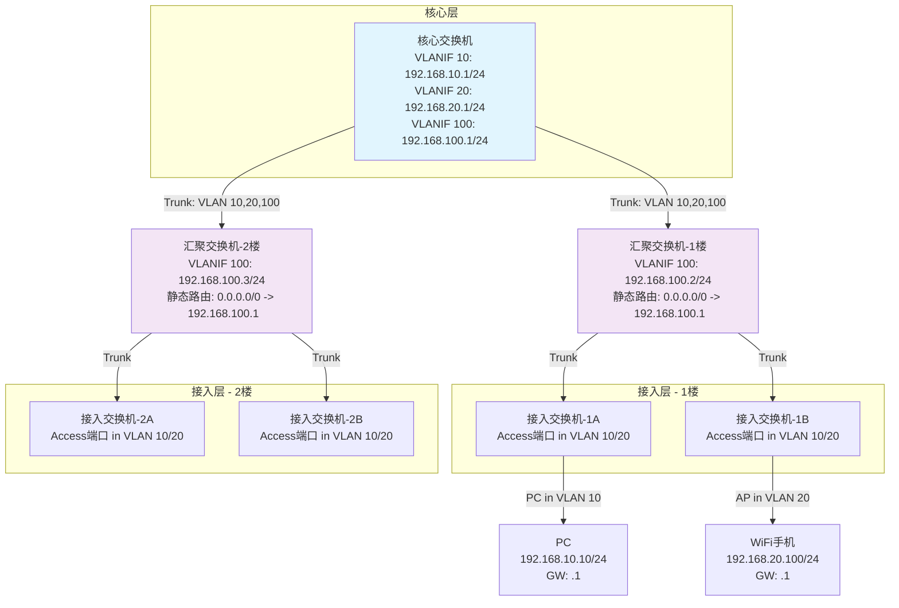
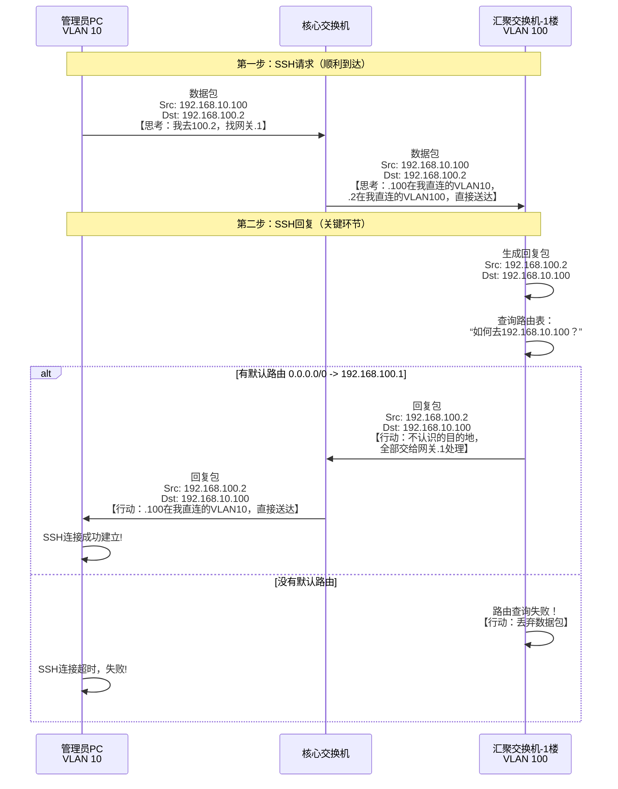

# 汇聚交换机为何要配置静态路由

---

### 关键配置与通信逻辑解读

上图展示了网络物理连接与逻辑结构，下表则详细解释了其配置与通信原理，特别是**为什么汇聚交换机需要默认路由**：

| 组件 | 核心配置示例 | 设计逻辑与通信说明 |
| :--- | :--- | :--- |
| **核心交换机** | `interface Vlanif 10`  `ip address 192.168.10.1 255.255.255.0` `interface Vlanif 100`  `ip address 192.168.100.1 255.255.255.0` | **作为所有终端的网关**。它拥有所有VLAN的接口IP，因此知道所有网段（直连路由）。它的核心任务是进行**三层路由**。 |
| **汇聚交换机** | `interface Vlanif 100`  `ip address 192.168.100.2 255.255.255.0` **`ip route-static 0.0.0.0 0.0.0.0 192.168.100.1`** | **1. 二层交换：** 负责楼宇内同一VLAN的通信。 **2. 需要管理：** 配置一个管理IP（在VLAN 100）。 **3. 关键路由：** 默认路由指向核心，是为了让它的**管理流量**（如SSH、SNMP）能返回给位于其他网段（如VLAN 10）的网管员PC。 |
| **接入交换机** | `interface G1/0/1`  `port link-type access`  `port default vlan 10` | 纯二层设备。职责是将终端（PC、AP）接入到正确的VLAN中。无需IP地址即可完成本职工作。 |

### 总结

通过上图和解说，我们可以清晰地看到：

1.  **横向流量（同一VLAN）**：例如1楼PC访问1楼打印机，流量在汇聚交换机上完成**二层交换**，不会抵达核心。
2.  **纵向流量（跨VLAN/上网）**：例如手机（VLAN 20）访问PC（VLAN 10）或互联网，流量必须抵达核心交换机进行**三层路由**。
3.  **管理流量**：网管员从VLAN 10的PC SSH管理汇聚交换机（VLAN 100）时，汇聚交换机依靠**默认路由**将回复包送回给核心，进而返回给网管员。**这正是那条静态路由存在的核心价值。**

---

我们直接聚焦于上面拓扑图中的 **汇聚交换机-1楼**，来详细拆解它**为什么必须配置那条静态默认路由**。

假设网络管理员在他位于 **VLAN 10** 的办公室电脑上（`IP: 192.168.10.100`）执行 `ssh 192.168.100.2` 来管理这台汇聚交换机。

下图完整展示了这个请求与回复的完整流程，以及静态路由在其中起到的关键作用：

---

### 总结：为什么这条路由不可或缺？

从上面的流程可以清晰地看到，这条 `ip route-static 0.0.0.0 0.0.0.0 192.168.100.1` 的命令，对于汇聚交换机而言，其作用是：

**为汇聚交换机本身发出的、去往非直连网段（尤其是管理终端所在的网段）的流量，提供一条“出山”的通道。**

*   **核心交换机** 是网络的中心枢纽，拥有全部VLAN的路由信息，自然知道如何到达所有地方。
*   **汇聚交换机** 在逻辑上位于网络的“枝叶”层，它通常只关心二层交换。但当它自己需要主动发起通信（如回复SSH请求、发送日志/SNMP陷阱）时，它就变成了一个**三层终端**。
*   **这条默认路由，就是汇聚交换机作为“终端”时的那张“网络地图”**，它告诉设备：“所有你不知道怎么去的地方，都把数据包交给核心交换机（`192.168.100.1`），它全知道。”

因此，配置这条静态路由，**不是为了终端用户的上网业务**，而是为了**网络设备自身的可管理性**，确保管理流量能够实现双向的、可靠的通信。这是构建一个“不仅连通，而且可控、可管”的专业网络的关键一步。