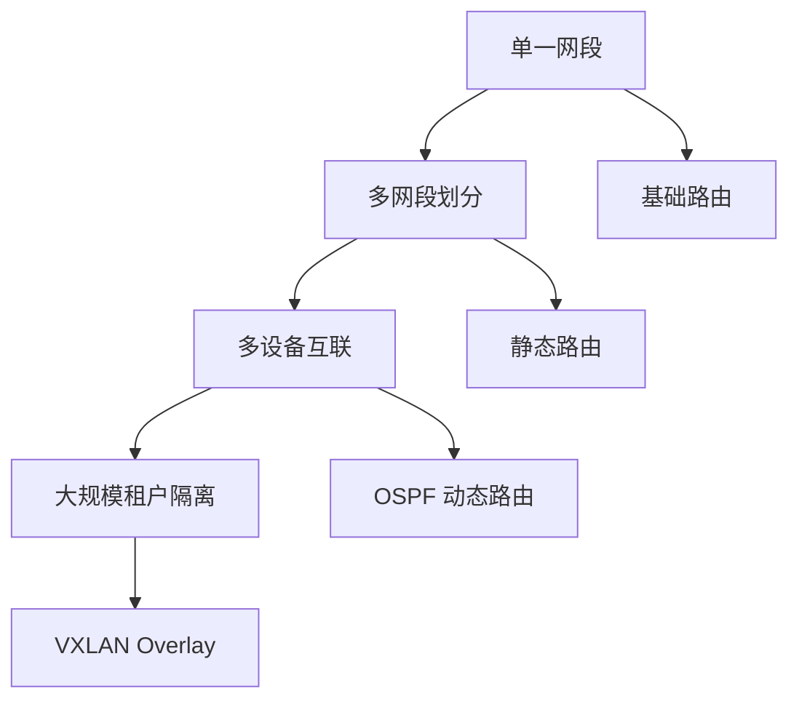

# 从“能用”到“可靠”：OSPF、BGP与VXLAN的网络演进逻辑

## 🌐 网络核心技术深度解析

### 核心概念演进路径

---

## 📊 核心技术对比总表

### 基础概念篇

| 维度 | 传统简单网络 | 现代中大型网络 | 💡 **核心洞察** |
|------|--------------|----------------|----------------|
| **租户隔离** | 无租户概念，所有用户在扁平网络中 | **多租户架构**，逻辑隔离不同客户/部门 | **VXLAN 解决云租户海量隔离** · 1600万 VNI vs VLAN 4000限制 · Overlay 提供网络灵活性 |
| **BGP 认知** | 感受不到，仅通过默认网关上网 | **互联网的"外交官协议"** · 自治系统间路由决策 · 全球流量路径优化 | **BGP 是互联网基石** 你的无感知正是它成功运行的证明 |
| **OSPF 定位** | "纯容灾"技术，需要冗余链路 | **三层网络"自动驾驶系统"** · 自动化路由管理 · 智能最优路径选择 · 故障秒级自愈 | **OSPF = 智能化运维** 容灾是亮点，自动化才是核心价值 |

### 技术细节篇

| 疑问点 | 初始认知 | 技术真相 | 🎯 **本质解析** |
|--------|----------|----------|-----------------|
| **OSPF 工作原理** | "发现"未知子网 | **同步已知路由信息** · 邻居发现建立邻接 · LSDB 同步网络地图 · SPF 算法计算最优路径 | **不是发现未知，而是同步已知** 从"手动配置"升级到"自动同步" |
| **OSPF 必要性** | 三层设备直联网段本就互通，配置OSPF多余 | **多三层设备场景必需** · 核心交换机A不知核心交换机B的网段 · 避免手动静态路由的繁琐配置 | **多设备网络中不是"多余"而是"必需"** 运维复杂度的分水岭 |
| **跨网段通信** | 困惑OSPF能否让傻瓜网络的新网段互通 | **必须经过三层网关** · 简单结构：单台三层交换VLAN接口 · 复杂结构：多设备间路由(静态/OSPF) | **OSPF ≠ 三层功能** OSPF是实现三层路由自动化的协议 |

---

## 🚀 技术演进四阶段

### 第一阶段：基础连通期
- **状态**：单一网段，二层交换
- **技术**：即插即用，傻瓜交换机
- **特点**：简单直接，规模受限

### 第二阶段：结构优化期  
- **触发**：部门/VLAN划分，安全隔离需求
- **技术**：**三层交换机 + 基础路由**
- **变革**：引入网段概念，需要路由功能

### 第三阶段：规模扩展期
- **触发**：多台三层设备，手动运维成本激增
- **技术**：**OSPF 动态路由**
- **价值**：自动化管理 + 高可用保障

### 第四阶段：云化演进期
- **触发**：租户数量爆炸，传统隔离技术达到上限
- **技术**：**VXLAN Overlay网络**
- **突破**：海量租户支持 + 极致网络灵活性

---

## 💎 核心结论

1. **BGP**：互联网的"外交基石"，内网通常无需接触
2. **OSPF**：从"手动运维"到"智能自治"的升级关键  
3. **VXLAN**：云时代海量租户隔离的终极解决方案
4. **演进逻辑**：每项技术都解决了特定规模下的特定痛点

> **关键认知跃迁**：您的困惑正体现了从"网络使用者"到"网络架构师"的思维转变——开始关注 scalability、automation、resilience 等架构级问题。

这样的排版是否更加清晰？我可以根据您的需要进一步调整某个部分的详细程度或展示方式。