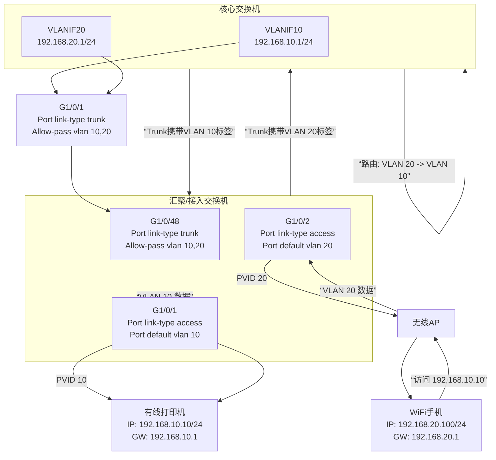

# 非OSPF的子网互通场景

好的，您描述的这个场景非常经典，这就是典型的三层核心、二层接入的网络架构。我们来彻底讲清楚这个结构的配置逻辑。

为了让您彻底理解，我将分三步讲解：
1.  **核心思想与数据流**
2.  **详细配置命令示例**
3.  **配置逻辑总结图**

---

### 第一步：核心思想与数据流

在您的架构中：
*   **核心交换机**：扮演“总指挥部”的角色，是所有VLAN的网关。它负责所有**跨VLAN的通信**（三层路由）。
*   **汇聚/接入交换机**：扮演“地方车站”的角色，只负责将设备（PC、打印机、AP）接入到正确的VLAN（二层交换），并把需要跨VLAN的流量送往“总指挥部”。

**一个数据包的旅程（WiFi手机访问有线打印机）：**
1.  手机（`VLAN 20`， `192.168.20.100`）要访问打印机（`VLAN 10`， `192.168.10.10`）。
2.  手机发现目标IP不在同一网段，将数据包发给它的网关——**核心交换机**的VLAN 20接口（`192.168.20.1`）。
3.  接入交换机通过打了VLAN 20标签的Trunk口，将数据包送上核心交换机。
4.  **核心交换机**收到数据包，进行路由查询： “目标 `192.168.10.10` 是我的直连网段 `192.168.10.0/24`（VLAN 10）”。
5.  核心交换机将数据包从VLAN 10的接口转发出去。
6.  数据包再通过打了VLAN 10标签的Trunk口，到达打印机所在的接入交换机，并最终送达打印机。

**关键在于：汇聚和接入交换机不负责做路由决策，它们只负责在正确的VLAN内传输数据。**

---

### 第二步：详细配置命令示例

我们以**华为/华三/锐捷**等通用命令风格为例（思科命令逻辑类似）。假设：
*   **VLAN 10**： 有线网络，网段 `192.168.10.0/24`，网关 `192.168.10.1`
*   **VLAN 20**： 无线网络，网段 `192.168.20.0/24`，网关 `192.168.20.1`
*   **核心交换机**与**汇聚交换机**之间使用 `G1/0/1` 互联。

#### 1. 核心交换机配置

```bash
# 创建所需VLAN
system-view
vlan batch 10 20

# 配置与汇聚交换机连接的物理接口为Trunk模式，并允许所有VLAN通过（或指定VLAN）
interface GigabitEthernet 1/0/1
 port link-type trunk
 port trunk allow-pass vlan all  # 或者 port trunk allow-pass vlan 10 20

# 创建VLAN接口（即虚拟网关接口），并配置IP地址
interface Vlanif 10
 ip address 192.168.10.1 255.255.255.0  # 这就是VLAN 10的网关
 description For-Wired-Network

interface Vlanif 20
 ip address 192.168.20.1 255.255.255.0  # 这就是VLAN 20的网关
 description For-Wireless-Network

# （可选但重要）配置一条默认路由，指向出口防火墙/路由器，用于上网
ip route-static 0.0.0.0 0.0.0.0 192.168.1.1  # 假设出口网关是192.168.1.1
```

**核心交换机的配置就完成了！它现在已经准备好为VLAN 10和20做路由了。**

#### 2. 汇聚交换机/接入交换机配置

汇聚交换机的主要任务是透传VLAN。

```bash
# 创建需要在本交换机上使用的VLAN（通常和核心保持一致）
system-view
vlan batch 10 20

# 配置上联核心的接口为Trunk模式
interface GigabitEthernet 1/0/48  # 假设这是上联口
 port link-type trunk
 port trunk allow-pass vlan all   # 允许必要的VLAN通过

# 配置下联接入层设备（PC、打印机、AP）的接口
# 接有线打印机（属于VLAN 10）
interface GigabitEthernet 1/0/1
 port link-type access   # 接口模式为Access
 port default vlan 10    # 将接口划入VLAN 10

# 接无线AP（AP的管理VLAN属于VLAN 20，AP发出的用户业务流量也由VLAN 20承载）
interface GigabitEthernet 1/0/2
 port link-type access
 port default vlan 20

# 如果AP本身需要管理VLAN，而业务是另一个VLAN，则上联口需配置为Hybrid或Trunk，此处略复杂，按简单场景处理。
```

---

### 第三步：配置逻辑总结图

下图清晰地展示了整个网络的数据流向与配置逻辑，说明了为何核心交换机是网关，以及流量如何跨越VLAN：


### 最终确认

按照上述方式配置后：
*   **手机**的IP地址应由AC/DHCP服务器分配为 `192.168.20.x/24`，网关为 `192.168.20.1`。
*   **打印机**的IP地址应手动设置为 `192.168.10.x/24`，网关为 `192.168.10.1`。

完成以上步骤，它们之间就可以正常通信了。这种架构下，**完全不需要OSPF**，因为所有VLAN的网关都在同一台设备上，路由是“直连”的。